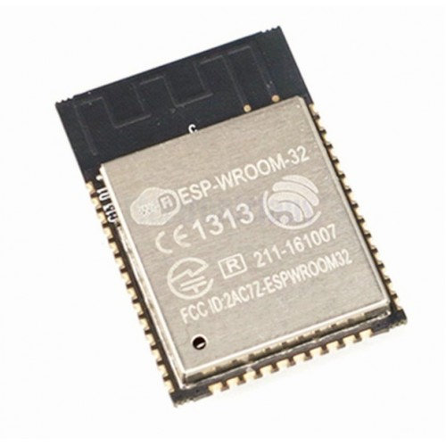

# 1. ESP32 開發板槪述
Copyright &copy; 2019 Mickey Chan. ALL RIGHTS RESERVED.  

## 專案目標：物聯網電門鎖
（整體計劃：物聯網出入保安系統專案）   

### 連接智能助理
  
### 保安考量
(MQTT/TLS)  
(ACL)  

## ESP32 規格

* 240MHz 雙核 LX6 微處理器；
* 內藏 448KB ROM；
* 內藏 520KB SRAM ＋ 16KB SRAM ( RTC )；
* 支援 802.11b/g/n Wi-Fi，最大傳輸速度 150Mbps；
* 支援藍牙 BR/EDR BLE；
* 內藏 4MB SPI Flash 記憶，寫入次數最多 100,000 次；
* 內藏霍爾效應感測器及 10 個電容式感應介面；
* 32kHz 水晶發振器
* 支援 SD card 介面；
* 附有 RTC 副系統，可進入超低電量（ ULP ）模式

ESP32 包括以下介面：

* 18 個 12 bits 類比-數碼轉換器 ( ADC ) 頻道（非線性電壓）
* 3 個 SPI 介面（ VSPI 和 HSPI ）
* 3 個 UART 介面
* 2 個 I2C 介面
* 16 個 PWM 輸出頻道
* 2 個 8 bits 數碼-類比轉換器 ( DAC )
* 2 個 I2S 介面
* 10 個電容式感應 GPIO
* 16 個 RTC GPIO ，可用作從低電量模式喚醒 EPS32

### 優點
* 可使用 Arduino IDE 編寫程式；
* 原廠 SDK 備有 OTA 更新、網頁伺服器、 UDP 通信等功能；

### 缺點
* 不擅於單精度浮點除數及所有雙精度浮點運算；

## ESP32 DevKitC 針腳

不同廠商推出的 ESP32 開發板在針腳位置和數量上都會有所分別，不過相同名稱的針腳在任何廠商的開發板中**功能都是一樣的**！

### 注意事項
* 各 GPIO 電壓為 3.3V ；
* 各 GPIO 絕對最大電流為 40mA ，大於這個電流的電路應使用 MOSFET 來控制（例如繼電器）；
* GPIO 6-11：由於連到 SPI Flash 記憶體，所以隨非你知道自己在做甚麼，否則不要使用；
* GPIO 34-39：由於並沒有內部 Pull-up 或 Pull-down 電阻，也不能產生 PWM ，只能夠用作輸入；
* 所有 GPIO 均可掛載外部插斷（ Interrupt ）處理函式；
* EN：也被稱為 RST ，將此腳接到 GND ，開發板即會重啟；

## 安裝 Arduino IDE ESP32 開發環境

（安裝程序） 
在選單選擇`Arduino`＞`Peferences `＞`Settings`

在`Additional Boards Manager URLs`欄輸入網址`https://dl.espressif.com/dl/package_esp32_index.json`。

如果有多於一個網址，可以按後面的介面按鈕，打開`Additional Boards Manager URLs`視窗，以一行一網址的方式將上述網址加到最後一行。

（開發板管理員）

（程式庫管理員）  

## 基本 ESP32 編程
（連接開發板）  
（上載程式）  
按著開發板上的 `BOOT` 按扭來按 `EN` 按鈕可進入 Bootloader 模式，可將資料寫進 ROM 裡。不過一般使用情況下， Arduino IDE 只要接上 microUSB 線就會在上載時自動處理這程序，不用手動操控。  
（串行監視器）  

### 小遊戲：利用開發板上的 BOOT 按鈕來控制板上的 LED 閃燈次數
* ESP32-DevKitC 開發板上的 LED 是連接到 `GPIO 2` 的。要注意這 LED 與一般外接 GPIO 時的 LED 不一樣， `HIGH` 的時候是關上，`LOW` 的時候才會亮著；
* EESP32-DevKitC 開發板上的 `BOOT` 按鈕是連接到 `GPIO 0` 的。這按鈕是內部連上了 Pull-Up 電阻的，所以設定時即使沒有指名 `INPUT_PULLUP` 也好，也是按下時為 `LOW` 的；
* 紀錄下用戶按下 `BOOT` 按鈕的次數；
* 當用戶停止輸入 1.3 秒後，按用戶按鍵的次數來閃動板上的 LED

[草稿碼](session_1.ino)

#### 程式解說
首先是一些常數和變數的宣告：

* 23-24 行：為兩 GPIO 設定具含意的名稱，提高程式碼可讀性；
* 27-29 行：宣告程式會用到的變數，並給予初始值；

接著是一些功能函式：

* 31-35 行：`gpioSetup()`是用來設定各 GPIO 的功能，即`INPUT`、`OUTPUT`、或`INPUT_PULLUP`，然後設定初始電壓;
* 37-49 行：`handlePushbutton()`是`Boot`按鈕被按下時的處理函數，將按掣次數紀錄在`pushCount`裡。另外由於按鈕在物理上有回彈的情況，所以我們設定了`lastPushing`來紀錄上次處理按鈕的時間，按下按鈕後， 0.3 秒內暫時不處理按鈕事件；
* 51-59 行：`publishButton()`是控制甚麼時候閃動 LED 的函式，當 1.3 秒內沒有輸入（按鈕）的話，就開始按按掣次數來閃動 LED；
* 61-68 行：`flashingLED()`是實際開關 LED 的程式；

最後就是 Arduino 程式的起始點和循環流程：

* 70-73 行：`setup()`裡要呼叫剛才寫好的`gpioSetup()`設定 GPIO 和串連通訊速度，以便將除錯資料傳回 Arduino IDE ；
* 75-78 行：`loop()`就循環呼叫按鈕處理函式和控制 LED 閃動的函式；

## 參考文獻
* [Arduino language reference](https://www.arduino.cc/en/Reference/HomePage)
* [Espressif Arduino core for ESP32 WiFi chip](https://github.com/espressif/arduino-esp32)
