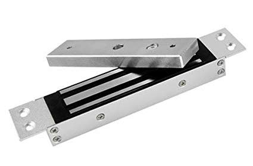
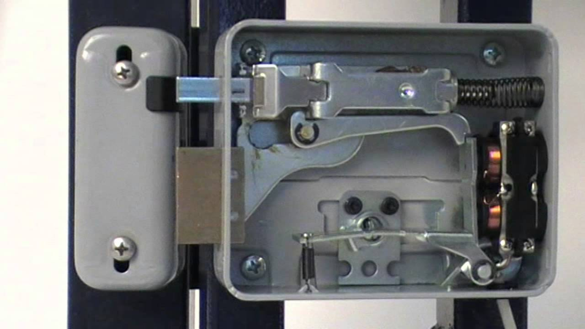
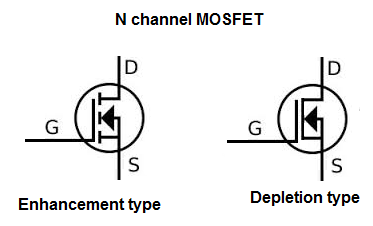
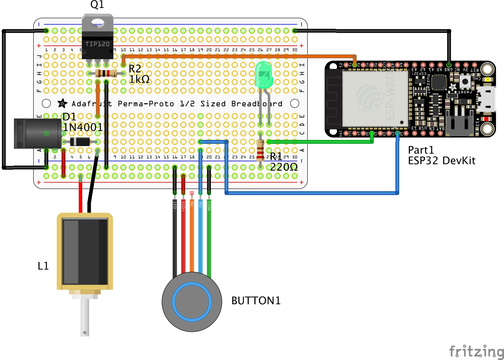

# 2. 基礎門鎖
Copyright &copy; 2019 Mickey Chan. ALL RIGHTS RESERVED.  

## 功能
* 按掣開啟電門鎖；
* 開鎖期間亮著綠色 LED；
* 開鎖 5 秒後自動重新上鎖

## 零件表
* 1 x ESP32 DevKitC 開發板（或兼容板）；
* 2 x 19 針單排母座；
* 1 x 12V 電門鎖；
* 1 x TIP120 電晶體；
* 1 x 1k Ohm 電阻；
* 1 x 1N4001 二極管；
* 1 x 2.1/5.5mm DC 電源插座；
* 1 x 綠色 LED；
* 1 x 220 Ohms 電阻；
* 1 x 16mm 帶 12V LED 按鈕（可選購帶面板門鐘掣）；
* 1 x 2 針 2.54mm JST 迷你直針插和座（電門鎖用）；
* 1 x 4 針 2.54mm JST 迷你直針插和座（帶 LED 按鈕用）；
* 1 x 1/2 麵包板；
* 適量杜邦線

## 電門鎖種類
電門鎖按照失去電力後的狀態為 Fail-security 和 Fail-safe 兩類。這兩類別所指的對象是**被關上的一方**。

### Fail-Security
* 失去電力後門會被鎖上；
* 保安優先；
* 需要電力來開啟門鎖；
* 因為只有開啟門鎖才需要用電，所以較為省電；
* 門閂型電門鎖通常都是 Fail-security 類

### Fail-Safe
* 失去電力後門鎖會開啟，可以讓人自由出入逃生；
* 安全優先；
* 需要電力鎖門；
* 由於需要長期供電才能上鎖，所以較為耗電；
* 電磁鐵型門鎖通常都是 Fail-safe 類

選用哪一類電門鎖主要看應用場景，例如大門鎖一般選用 Fail-safe 類，以防火警時無法開門逃生。當然現在有很多大門用的 Fail-security 電門鎖可以透過撥桿等物理方式來開啟門鎖逃生。

### 連接電門鎖要注意浪湧電壓
電門鎖這類有線圈的電子零件在接上電源時可以產生磁力，但相反磁力也可以令線圈產生電力。線圈在通電後如果關上電源（例如這裡將 TIP120 的基極設為 LOW ），會有一瞬間在開關掣一邊，產生比連到線圈的電壓大幾倍的電壓，這個電壓剛好與連接電門鎖的電源方向相反，會破壞其他電子零件（這裡就會將 TIP120 擊穿）。所以要並聯一支二極管（如 1N4001 、 1N4007 或 1N4148）來保護電路。

其他含有線圈的電子零件還包括以下幾種：

* 電感
* 繼電器
* 變壓器
* 各種摩打
* 喇叭

## 控制大電源：運用 TIP120 或 MOSFET 電晶體
### TIP120

TIP120 是由兩粒電晶體組成的達靈頓電晶體，第一個電晶體的射極（Emitter）連接到第二個電晶體的的基極（Base）。這提供了非常高的電流增益，但是使所需的基極偏置電壓加倍並增加了集極（Collector）飽和電壓。

使用 TIP120 時，需要在基極與 GPIO 之間串接 1K 電阻。

### MOSFET （金屬氧化物場效應電晶體）  

MOSFET 是一種通過電場效應控制電流的電子元件。只要在閘極（Gate）加入電壓，電流就可以由汲極（Drain）流向源極（Source），而閘極與其他電極是以絕緣體分隔的。有反應快的特點，適用於高頻、大負荷的開關，例如用 PWM 來控制電風扇，或需要較大電流驅動的繼電器。

為了確保在開啟電源至程式設定 GPIO 電壓初值之間的空隙時間裡，連接 MOSFET 的 GPIO 處於低電壓（LOW）狀態，可以在 GPIO 上接上 10K Pull-down 電阻至 GND 。

## 接線
* 12V 電源的正極連接電門鎖的正極；
* 電門鎖的負極連接 TIP120 的集極（ C ）；
* 為免電門鎖的線圈發生浪湧電壓，在電門鎖兩極間接上 1N4001 二極管；
* TIP120 的基極（ B ）經 1k Ohm 電阻連接到 GPIO17;
* TIP120 的射極（ E ）直接接地；
* 開門按鈕正極直接連接 GPIO27 （使用內部 Pull-up），負極接地；
* 如果使用備有 12V LED 的大型按鈕，可以將 LED 正極連接 12V 輸入，負極接地；
* GPIO32 連到綠色 LED ，經 220 Ohm 電阻接地

### 線路圖

### 麵包板

## 草稿碼
* 當 GPIO27 （開門按鈕） 電壓變為 LOW 時，將 GPIO17 （電門鎖） 和 GPIO32 （綠色 LED） 設為 HIGH，並紀錄開鎖時間；
* 當解鎖超過 5 秒時，將 GPIO17 和 GPIO32 設為 LOW （上鎖）

[基礎門鎖草稿碼](session_2.ino)

### 程式解說
首先是常數和變數的宣告：

* 23-25 行：為 GPIO 設定有含意的名稱；
* 27 行：設定自動重新上鎖的時間為 5 秒；
* 29-33 行：宣告全域變數並設定初始值；

接著是一些功能函式：

* 35-44 行：`gpioSetup()` 設定各 GPIO 的功能，並設定初始電壓。其中連接按鈕的 GPIO 可以設定為 INPUT_PULLUP 以使用內部 Pull-up 電阻；
* 46-51 行：`lock()`是上鎖動作的實際執行程序；
* 53-59 行：`unlock()`是開鎖動作的實際執行程序，並且紀錄開鎖時間；
* 61-67 行：`handlePushButton()`負責傾聽按動開門按鈕事件，指揮開門；
* 69-75 行：`handleAutoRelock()`根據`UNLOCK_TIMEOUT`設定的自動上鎖時間，在開鎖經過 5 秒後自動重新上鎖；

最後就是 Arduino 程式的起始點和循環流程：

* 77-80 行：`setup()`裡要呼叫剛才寫好的`gpioSetup()`設定 GPIO 和串連通訊速度，以便將除錯資料傳回 Arduino IDE ；
* 82-85 行：`loop()`先以`handlePushButton()`看看用戶有沒有按開門按鈕並決定是否開鎖，然後就執行`handleAutoRelock()`查看是否要重新上鎖。
