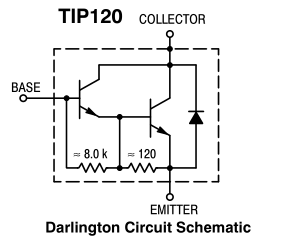
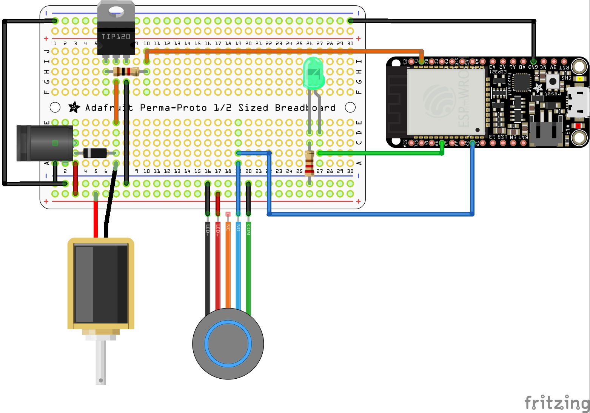

# 2. 基礎門鎖
## 功能
* 按掣開啟電門鎖
* 電門鎖開啟時亮著綠色 LED
* 電門鎖開啟 5 秒後自動重新上鎖

## 電門鎖種類
電門鎖按照失去電力後的狀態為 Fail-security 和 Fail-safe 兩類。這兩類別所指的對象是_被關上的一方_。

### Fail-Security
* 失去電力後門會被鎖上
* 保安優先
* 需要電力來開啟門鎖
* 因為只有開啟門鎖才需要用電，所以較為省電
* 門閂型電門鎖通常都是 Fail-security 類

### Fail-Safe
* 失去電力後門鎖會開啟，可以讓人自由出入
* 安全優先
* 需要電力鎖門
* 由於需要長期供電才能上鎖，所以較為耗電
* 電磁鐵型門鎖通常都是 Fail-safe 類

選用哪一類電門鎖主要看應用場景，例如大門鎖一般選用 Fail-safe 類，以防火警時無法開門逃生。當然現在有很多大門用的 Fail-security 電門鎖可以透過撥桿等物理方式來開啟門鎖逃生。

## 如何使用 TIP120 晶體管控制 12V 電源
### TIP120

TIP120 是由兩粒電晶體組成的達靈頓電晶體，第一個電晶體的射極（Emitter）連接到第二個電晶體的的基極（Base）。這提供了非常高的電流增益，但是使所需的基極偏置電壓加倍並增加了集極（Collector）飽和電壓。

使用 TIP120 時，需要在基極與 GPIO 之間串接 1K 電阻。

### MOSFET （金屬氧化物場效應電晶體）  

MOSFET 是一種通過電場效應控制電流的電子元件。只要在閘極（Gate）加入電壓，電流就可以由汲極（Drain）流向源極（Source），而閘極與其他電極是以絕緣體分隔的。有反應快的特點，適用於高頻、大負荷的開關，例如用 PWM 來控制電風扇，或需要較大電流驅動的繼電器。

為了確保在開啟電源至程式設定 GPIO 電壓初值之間的空隙時間裡，連接 MOSFET 的 GPIO 處於低電壓（LOW）狀態，可以在 GPIO 上接上 10K Pull-down 電阻至 GND 。

## 接線
### 線路圖

### 麵包板

  

## 草稿碼

### 自動重新上鎖 1：單純重新上鎖

## 參考文獻
