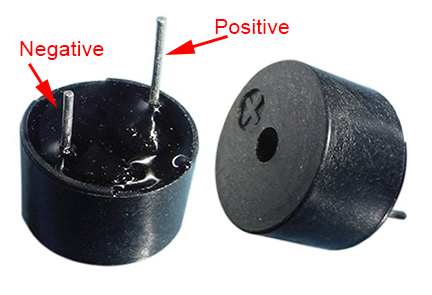
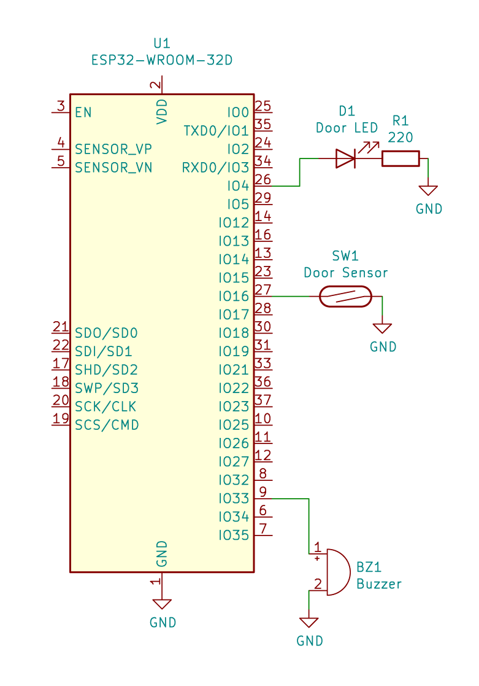
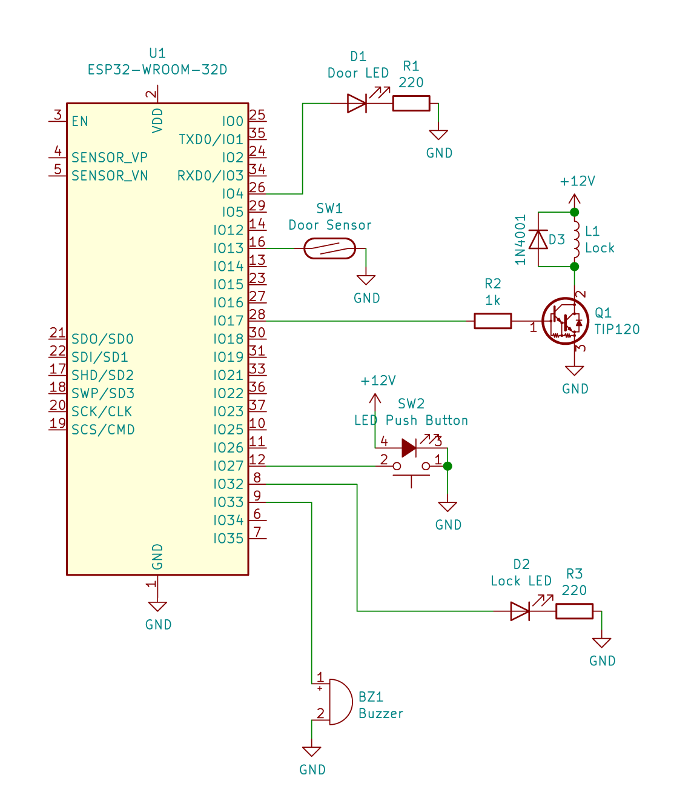

# 3. 門窗感測
Copyright &copy; 2019 Mickey Chan. ALL RIGHTS RESERVED.  

## 功能
* 感測門是否被開啟
* 門被開啟時亮起紅色 LED ，並發出警號

## 門窗感測器

磁力開關（ Reed switch ），又稱為干簧管，常見的是一支小玻璃管，裡面封裝了簧片和惰性氣體，當有磁力靠近時就會閉合通電。而門窗感測器就是把玻璃管封裝在匣子裡，並附上一粒不太強的磁石。安裝在門和門框上，就能感測門窗的開關狀態。

有部分門窗感測器／磁力開關更像繼電器一樣有三支電極，即常開（ NO ，有磁場時接通）、常閉（ NC ，沒有磁場時接通）和 COM ，讓大家可以對不同的磁場狀況作不同處理。

## 蜂鳴器種類
### 主動式蜂鳴器
* 有正負電極之分
* 只要通電，就能利用內藏的發震器來發聲
* 給予方形波可以產生不同頻率的聲音

### 被動式蜂鳴器
* 沒有正負極之分
* 必須給予方形波或交流電才可以產生指定頻率的聲音

## 接線
### 線路圖

### 麵包板

## 草稿碼
[門窗感測草稿碼](session_3_1.ino)

## 完整電門鎖電路
### 線路圖

### 麵包板

## 草稿碼
[完整電門鎖草稿碼](session_3_2.ino)
