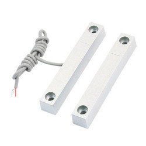
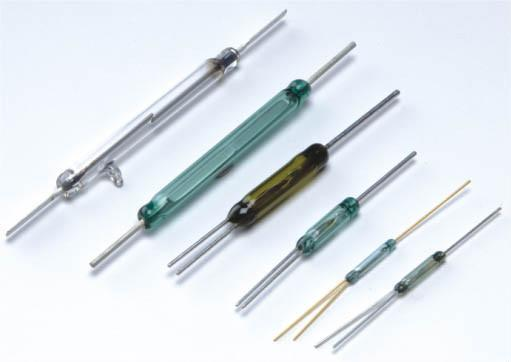
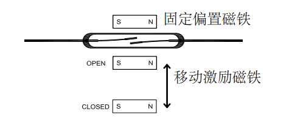
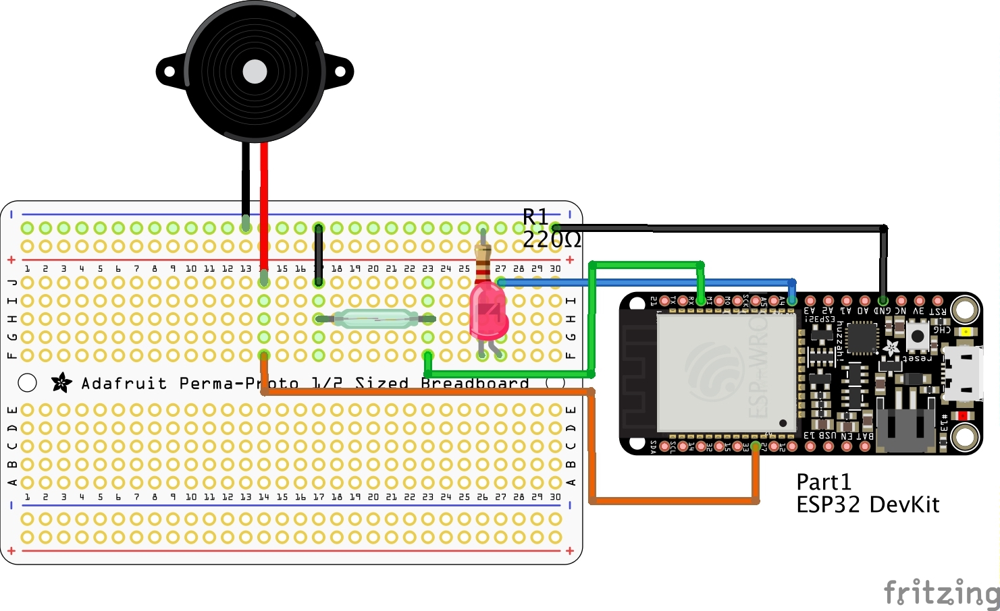
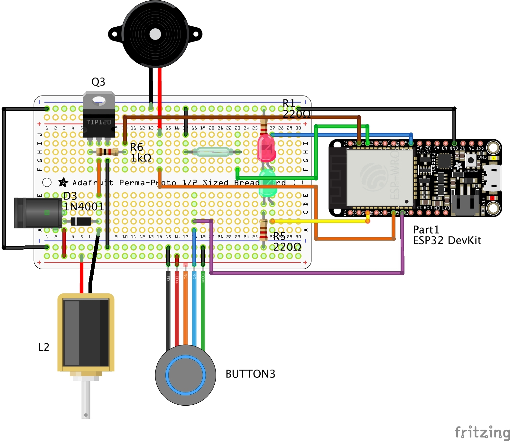
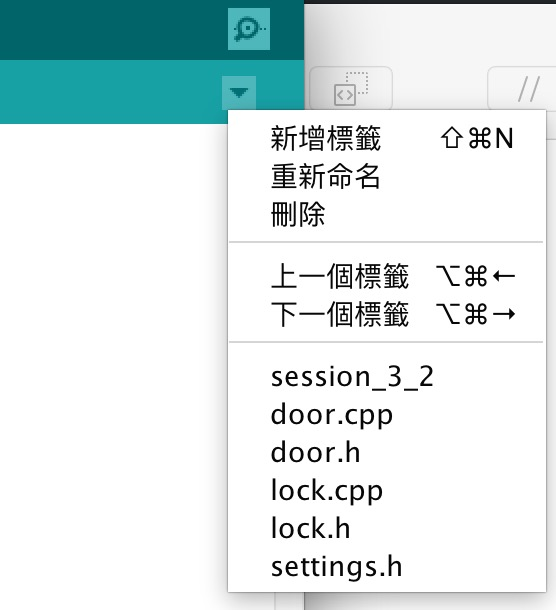
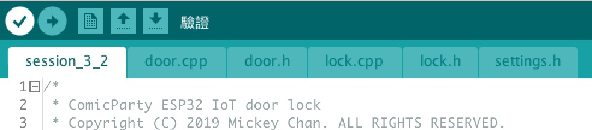

# 3. 門窗感測
Copyright &copy; 2019 Mickey Chan. ALL RIGHTS RESERVED.  

## 功能
* 感測門是否被開啟；
* 門被開啟時亮起紅色 LED ，並發出警號

## 零件表
* 1 x ESP32 官方開發板（或兼容板）；
* 2 x 19 針單排母座；
* 1 x 門窗感測器（磁力開關 ＋ 磁石）；
* 1 x 紅色 LED；
* 1 x 220 Ohms 電阻；
* 1 x 有源蜂鳴器；
* 1 x 2 針 2.54mm JST 迷你直針插和座（門窗感測器用）；
* 1 x 麵包板；
* 適量杜邦線

## 門窗感測器


磁力開關（ Reed switch ），又稱為干簧管，常見的是一支小玻璃管，裡面封裝了簧片和惰性氣體，當有磁力靠近時就會閉合通電。而門窗感測器就是把玻璃管封裝在匣子裡，並附上一粒不太強的磁石。安裝在門和門框上，就能感測門窗的開關狀態。

有部分門窗感測器／磁力開關更像繼電器一樣有三支電極，即常開（ NO ，有磁場時接通）、常閉（ NC ，沒有磁場時接通）和 COM ，讓大家可以對不同的磁場狀況作不同處理。




## 蜂鳴器種類
### 有源蜂鳴器
* 有正負電極之分；
* 只要通電，就能利用內藏的發震器來發聲；
* 給予方形波可以產生不同頻率的聲音


### 無源蜂鳴器
* 沒有正負極之分；
* 必須給予方形波或交流電才可以產生指定頻率的聲音；
* 使用起來像一般喇叭

## 接線
* 門窗感測器其中一支電極直接連接 GPIO16 （使用內部 Pull-up），另一電極接地；
* GPIO4 連到紅色 LED ，經 220 Ohm 電阻接地；
* GPIO33 連接到有源蜂鳴器正極，蜂鳴器負極接地

### 線路圖


### 麵包板


## 草稿碼
* 當 GPIO16 （門窗感測器）電壓為 HIGH （門啟）時，將 GPIO4 （紅色 LED）和 GPIO33 （蜂鳴器）設為 HIGH；
* 當 GPIO16 （門窗感測器）電壓為 LOW （門啟）時，將 GPIO4 （紅色 LED）和 GPIO33 （蜂鳴器）設為 LOW

[門窗感測草稿碼](session_3_1/session_3_1.ino)

## 完整門鎖電路
### 線路圖


### 麵包板


## 使用標籤建立函式庫
假如將電門鎖和門窗感測的草稿碼合併在一個文件裡，草稿碼會變得很冗長雜亂，不利於找出錯處。所以最好是按功能將程式碼分拆成函式庫，這就可以令草稿碼看起來很簡潔了。

在 Arduino IDE ，函式庫可以以標籤方式存在（另一個方式是放在 Arduino/libraries 目錄下，讓其他專案也可以取用）。所有標籤都會在驗證／上載時一同編譯。

### 標頭檔（ .h ）與程式碼（ .cpp ）
（ C++ 檔案類型）
(建立標籤）





### 分拆細節

我們將草稿碼按功能分拆成 4 部分，共 6 個檔案：

* [主程式](session_3_2/session_3_2.ino)。電門鎖程式的入口，負責控制程式流程；
* 電門鎖函式庫([.cpp](session_3_2/lock.cpp) | [.h](session_3_2/lock.h))。負責處理有關電門鎖的操作，包括開關電門鎖、處理電掣事件、自動重新鎖等；
* 門窗感測器函式庫([.cpp](session_3_2/door.cpp) | [.h](session_3_2/door.h))。負責處理門窗感測器的感測和反應。
* [設定檔](session_3_2/settings.h)。只有一個 .h 標頭檔，集中存放整個電門鎖程式的設定值，例如 GPIO 針位、重新上鎖的時間等。

### 解決開著門時自動上鎖的問題

過去電門鎖有一個問題：就是有可能在未關上之前就自動上鎖，如果使用「撥閂型電門鎖」的話，這有可能會因為橫閂伸了出來而無法關門上鎖。整合了門窗感測之後，我們就可以按照門的關關狀況而決定甚麼時候自動上鎖。

要注意的是，由於使用磁石的關係，門關到一定程度時，門窗感測器就會以為門已關上。如果一感測到門關上後就立即上鎖的話，有可能會在未關貼前就上鎖，所以即使門窗感測器感應到門關上，也應該延遲一點以避免問題。

* 當 GPIO17 處於 HIGH （解鎖）時，如果 GPIO16 同樣被設為 HIGH （開門），即暫停自動重新上鎖；
* 當 GPIO16 回復為 LOW （關門）後，延遲 1.5 秒後將 GPIO17 設為 LOW

我們在 `settings.h` 裡新增一個常數 `AUTO_RELOCK_DELAY` 來設定延遲時間，並將 `lock.cpp` 裡 `handleAutoRelock()` 函數的自動上鎖判斷式改成這樣：

```cpp
if (!isLocked && 
    !isDoorOpened && 
    (millis() - lastUnlockTime) > UNLOCK_TIMEOUT && 
    (millis() - lastDoorBounceTime + DOOR_BOUNCE_DELTA) > AUTO_RELOCK_DELAY
) {
    ...
}
```
